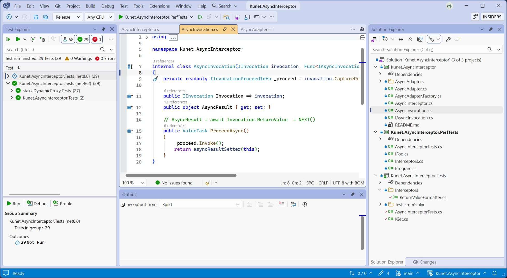

# Visual Studio 2026 Theme Color Schema

## How to apply it?

1. Open `Tools > Options > All Settings > Environment > Visual Experience > Theme Colors`
2. Click 'Open file' (for first time user, edit any color first to generate the file).
3. Copy the colors from following schema to the opened file.
4. Restart Visual Studio.

### [Blue Theme (applicable to light-based themes)](./Blue.json)
